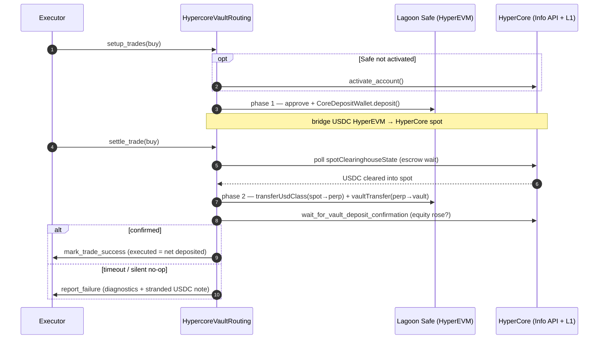
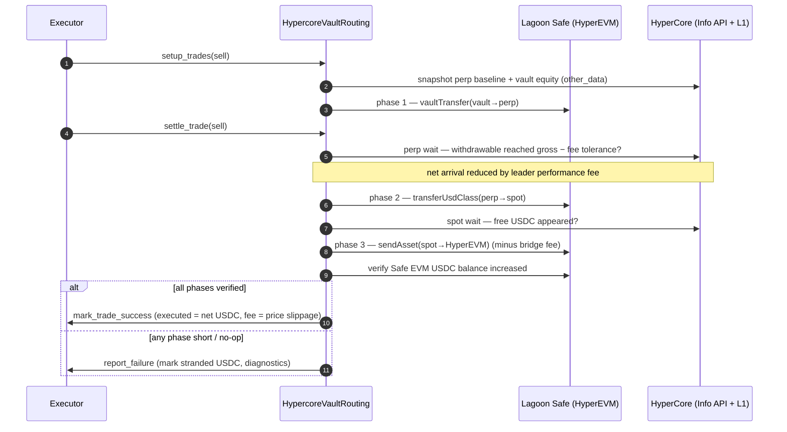
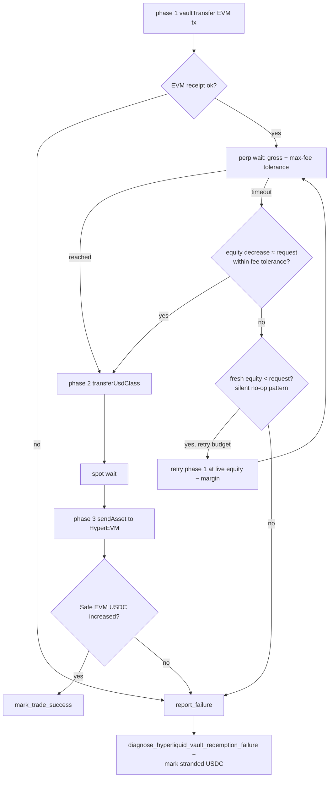

# HyperCore native vault execution

A strategy can hold a **Hyperliquid HyperCore native vault** as a trading
position — for example following a copy-trading vault like IKAGI or the
protocol HLP vault. Buying the position deposits the reserve currency (USDC)
into the vault; selling redeems it back to USDC. From the strategy's point of
view it looks like any other vault position, but the execution mechanics are
unusual: the vault does not live on an EVM chain as an ERC-4626 contract.
It lives on **HyperCore**, Hyperliquid's off-chain L1, and money has to be
walked across the HyperEVM ↔ HyperCore boundary one leg at a time.

This document explains what HyperCore vaults are, the data structures the
trade-executor uses to drive them, the multi-phase deposit and withdrawal
state machines, how we talk to HyperEVM and the HyperCore API, and where the
code lives.

> **Scope note.** This is about the strategy *depositing into an external
> HyperCore vault*. It is a different code path from the ERC-7540 / Lagoon /
> Ostium async-vault flow described in [`vault-deposit-redeem.md`](./vault-deposit-redeem.md).
> The two share vocabulary (deposit/redeem, pending, claim) but no code.

## What a HyperCore vault is

HyperCore is Hyperliquid's high-performance L1 that runs the perp and spot
order books. A **native vault** is a HyperCore primitive (not an ERC-4626
contract): depositors send USDC into the vault, the vault leader trades it,
and depositors share the PnL pro-rata. HyperEVM is the EVM-compatible chain
attached to the same validator set; USDC can be bridged between HyperEVM and
HyperCore through system contracts.

Key properties that shape our execution:

- **Off-chain accounting.** Vault equity, perp balances and spot balances live
  on HyperCore and are read over the Hyperliquid **Info HTTP API**, not via
  EVM `eth_call`. Only the bridge legs are EVM transactions.
- **Multi-account model.** A user has three relevant balances on HyperCore:
  the **vault equity**, the **perp (clearinghouse) account**, and the **spot
  account**. Moving value between them requires explicit actions
  (`vaultTransfer`, `transferUsdClass`) that settle asynchronously.
- **Leader performance fee (per vault).** User-created leader vaults charge a
  ~10% performance fee on depositor profit, deducted on or before withdrawal;
  protocol vaults (HLP and its sub-vaults) charge nothing. The net USDC a
  redemption returns can therefore be materially smaller than the gross amount
  requested. The rate is carried per vault on the trading pair
  (`other_data["vault_performance_fee"]`), not assumed as a constant.
- **Lock-ups and minimums (per vault).** Deposits lock for a period that also
  differs per vault — 1 day for leader vaults, 4 days for protocol/HLP vaults;
  withdrawals below a ~5 USDC floor are silently rejected; `vaultTransfer` has
  no "withdraw all" mode and silently no-ops if you ask for more than current
  equity.
- **Silent failures.** Bridge and transfer actions can have a successful EVM
  receipt while HyperCore moves nothing. Every phase must therefore be
  *verified* against HyperCore state, not trusted on receipt status.

For the upstream protocol and guard-side background, cross-link to eth_defi:

- `eth_defi.hyperliquid.core_writer` — CoreWriter action encoding (deposit,
  `vaultTransfer`, `transferUsdClass`, `sendAsset`).
- `eth_defi.hyperliquid.evm_escrow` — HyperEVM→HyperCore bridge escrow lifecycle.
- `eth_defi.hyperliquid.vault` — `HyperliquidVault`, `VaultInfo`,
  `estimate_max_withdrawal_commission`.
- `eth_defi.hyperliquid.api` — Info API readers (clearinghouse / vault equity).
- eth_defi docs: `docs/README-Hypercore-guard.md`,
  `docs/README-hyperliquid-vault-limitations.md`, and the
  `docs/source/tutorials/lagoon-hyperliquid.rst` tutorial.

## Data structures in trade-executor

The driver lives in `tradeexecutor/ethereum/vault/hypercore_routing.py`.

| Type | Role |
|---|---|
| `HypercoreVaultRouting(RoutingModel)` | Builds, signs, broadcasts and verifies all phases. Holds the HyperEVM `web3`, the `LagoonVault` (whose Safe is the on-chain account), the deployer `HotWallet`, and the reserve token address. |
| `HypercoreVaultRoutingState(RoutingState)` | Per-cycle routing state. |
| `HypercoreWithdrawalVerificationError` | A phase did not reach the expected HyperCore balance within the timeout. |
| `HypercoreWithdrawalPreflightError` | Live preconditions (lock-up, equity, minimum) failed before broadcasting. |
| `SettlementBroadcastError` | A settlement transaction failed to broadcast/confirm; carries the partial `BlockchainTransaction`. |

From eth_defi (`eth_defi.hyperliquid`): `HyperliquidSession` (Info API client),
`HyperliquidVault` + `VaultInfo` + `VaultFollower` (vault metadata, including
`commission_rate` = leader performance fee), and `UserVaultEquity`.

### Persisted per-trade state (`trade.other_data`)

Because each phase can be interrupted by a crash or restart, the routing
persists everything needed to resume into `trade.other_data`. These keys are
the contract between `setup_trades()` and `settle_trade()`:

| Key | Written when | Purpose |
|---|---|---|
| `hypercore_phase1_spot_baseline_usdc` | setup, before deposit phase 1 | Spot balance baseline so the escrow increase can be measured. |
| `hypercore_phase1_perp_baseline_usdc` | setup, before withdrawal phase 1 | Perp withdrawable baseline; captured *before* broadcast because `vaultTransfer` can settle before receipt handling. |
| `hypercore_phase1_vault_equity_usdc` | setup / preflight | Pre-withdrawal vault equity, the "before" value for detecting whether a withdrawal already reduced equity. |
| `hypercore_activation_cost_raw` | setup, first buy | USDC consumed activating the Safe on HyperCore (deducted once per cycle). |
| `hypercore_capped_deposit_raw` | deposit preflight | Deposit capped to actual Safe EVM USDC balance. |
| `hypercore_capped_withdrawal_raw` | withdrawal preflight / retry | Withdrawal capped to live vault equity minus safety margin. |
| `hypercore_stranded_usdc` | on failure | Records USDC stranded mid-pipeline (perp/spot) for operator recovery. |
| `hypercore_failure_diagnosis` | on failure | Full diagnostic snapshot string. |

## How execution is wired

HyperCore trades are executed sequentially, not in parallel, because the legs
mutate shared HyperCore balances and the deployer nonce:

```
LagoonExecution.execute_trades()            tradeexecutor/ethereum/lagoon/execution.py
  └─ ExecutionModel.execute_trades()        tradeexecutor/ethereum/execution.py
       └─ _execute_trades_sequentially()    (HypercoreVaultRouting.needs_sequential_trade_execution() → True)
            ├─ routing.setup_trades(...)     build + broadcast phase 1, activate if needed
            └─ routing.settle_trade(...)     finish remaining phases, verify, mark success/failed
```

`setup_trades()` activates the Safe on HyperCore if needed (buys only),
captures the baselines above, and builds **phase 1** of each trade.
`settle_trade()` dispatches by direction to `_settle_deposit()` /
`_settle_deposit_simulate()` or `_settle_withdrawal()`, which run the remaining
phases. A failure calls `report_failure()`, which surfaces as
`ExecutionHaltableIssue` and stops the sequential batch.

## Deposit (buy) flow

A deposit walks USDC from the HyperEVM Safe into the HyperCore vault:

0. **Activation** (once per Safe): `activate_account()` — only if not yet active.
1. **Phase 1**: `approve` + `CoreDepositWallet.deposit()` — bridge USDC from the
   HyperEVM Safe into HyperCore **spot** (built in `setup_trades`).
2. **Escrow wait**: poll `spotClearinghouseState` until the bridged USDC clears
   the EVM escrow into spot (`wait_for_evm_escrow_clear`).
3. **Phase 2**: `transferUsdClass(spot→perp)` + `vaultTransfer(perp→vault)` —
   move into the vault (built in `_settle_deposit`); then
   `wait_for_vault_deposit_confirmation` verifies vault equity rose.



## Withdrawal (sell) flow

A withdrawal walks USDC back from the vault to the HyperEVM Safe through three
HyperCore legs, each verified against a balance poll:

1. **Phase 1**: `vaultTransfer(vault→perp)` — redeem to the perp account.
2. **Perp wait**: poll `clearinghouseState` until withdrawable USDC appears
   (`_wait_for_perp_withdrawable_balance`).
3. **Phase 2**: `transferUsdClass(perp→spot)`.
4. **Spot wait**: poll `spotClearinghouseState` until free USDC appears.
5. **Phase 3**: `sendAsset(spot→HyperEVM)` — bridge back; then verify the Safe's
   EVM USDC balance increased (`_wait_for_usdc_arrival`).



### Tolerances and the performance fee

The perp-wait verification is the subtle part. The gross requested redemption
can arrive short for three legitimate reasons: ordinary NAV drift, the trade's
slippage tolerance, and — dominantly — the **leader performance fee** taken
from redeemed profit. This fee is *per vault*: user-created leader vaults charge
~10%, while protocol vaults (HLP and its sub-vaults) charge 0% (and lock up for
4 days instead of 1). `_settle_withdrawal()` therefore resolves the rate per
vault with `_resolve_vault_performance_fee()` — first from the trading pair
metadata (`other_data["vault_performance_fee"]`, populated by the
trading-strategy data pipeline and by `create_hypercore_vault_pair()`), then a
live `leaderCommission` read, and only as a last resort
`HYPERCORE_DEFAULT_PERFORMANCE_FEE` (10%). It then uses the worst-case fee
(`estimate_max_withdrawal_commission(gross, rate)`) as the maximum acceptable
phase-1 shortfall. The same tolerance feeds
`_is_withdrawal_already_reflected_in_vault_equity()`, the fallback that accepts
a redemption already visible as reduced vault equity. A fee-shaped shortfall is
booked as **execution price slippage** (fewer USDC for the same quantity), not
as fewer vault units sold.

## Withdrawal settlement state machine



## HyperEVM interactions

Although the *vault* lives on HyperCore, every action originates as a HyperEVM
transaction signed by the deployer hot wallet and routed through the Lagoon
Safe's `TradingStrategyModuleV0`:

- **Connection.** HyperEVM `web3` is built with `create_multi_provider_web3()`
  from `JSON_RPC_HYPERLIQUID`. HyperCore *state* is read separately over the
  Info HTTP API via `HyperliquidSession` (`eth_defi.hyperliquid.session`).
- **CoreWriter system contract.** Bridge/transfer actions are encoded by
  `eth_defi.hyperliquid.core_writer` as raw action bytes and submitted to the
  CoreWriter precompile at `0x3333…3333` on HyperEVM. The `build_hypercore_*`
  helpers return `ContractFunction` objects already wrapped for the Safe, so
  the routing signs them directly with the deployer `HotWallet` rather than via
  `LagoonTransactionBuilder` (which would double-wrap them).
- **Fixed gas pricing.** HyperEVM has no meaningful priority-fee market, so the
  routing uses fixed `maxFeePerGas` / `maxPriorityFeePerGas` constants instead
  of per-phase estimation, which previously caused phase failures.
- **Big blocks guard.** `__init__` asserts the deployer is *not* in big-blocks
  mode (`fetch_using_big_blocks`), which would push txs to the ~1-minute
  mempool instead of ~1 s.
- **Multi-node broadcast.** Settlement transactions broadcast through
  `wait_and_broadcast_multiple_nodes` for reliability on HyperEVM.
- **Bridge fee.** Core→HyperEVM `sendAsset` is not fee-free; phase 3 reserves
  headroom so the bridged amount does not exceed available spot.

## Top-level modules and functions

**trade-executor**

- `tradeexecutor/ethereum/vault/hypercore_routing.py` — `HypercoreVaultRouting`
  with the public surface `setup_trades()`, `settle_trade()`,
  `needs_sequential_trade_execution()`, `create_routing_state()`,
  `perform_preflight_checks_and_logging()`, and the
  `diagnose_hyperliquid_vault_redemption_failure()` diagnostics. Internal phase
  helpers: `_create_deposit_or_withdraw_txs()`, `_settle_deposit()`,
  `_settle_withdrawal()`, the `_broadcast_*` phase senders, the `_wait_for_*`
  verifiers, `_resolve_vault_performance_fee()`, and `_mark_stranded_usdc()`.
- `tradeexecutor/ethereum/lagoon/execution.py` — integrates HyperCore routing
  into the Lagoon execution model (sequential execution).

**eth_defi (`deps/web3-ethereum-defi`)**

- `eth_defi.hyperliquid.core_writer` — `build_hypercore_approve_deposit_wallet_call`,
  `build_hypercore_deposit_to_spot_call`, `build_hypercore_deposit_phase2`,
  `build_hypercore_withdraw_from_vault_call`,
  `build_hypercore_transfer_usd_class_call`,
  `build_hypercore_send_asset_to_evm_call`, `compute_spot_to_evm_withdrawal_amount`,
  `MINIMUM_VAULT_DEPOSIT`.
- `eth_defi.hyperliquid.evm_escrow` — `activate_account`, `is_account_activated`,
  `wait_for_evm_escrow_clear`, `DEFAULT_ACTIVATION_AMOUNT`.
- `eth_defi.hyperliquid.api` — `fetch_perp_clearinghouse_state`,
  `fetch_spot_clearinghouse_state`, `fetch_user_vault_equity`,
  `fetch_user_abstraction_mode`, `wait_for_vault_deposit_confirmation`,
  `HypercoreDepositVerificationError`.
- `eth_defi.hyperliquid.vault` — `HyperliquidVault`, `VaultInfo`,
  `estimate_max_withdrawal_commission`.
- `eth_defi.hyperliquid.session` — `create_hyperliquid_session`,
  `HyperliquidSession`.
- `eth_defi.hyperliquid.block` — `fetch_using_big_blocks`.

## Known issues and incident history

Several production incidents have shaped the settlement logic — phantom
positions, unverified withdrawals, stranded USDC, dual-chain confirmation,
nonce sync, activation cost, bridge-dry, satellite gas, API-down crashes,
precompile stale reads, minimum deposit, big blocks, robust escrow wait, and
the phase-1 performance-fee shortfall. The constants and inline comments in
`hypercore_routing.py` carry the per-incident rationale (dated incident
references); the `CHANGELOG.md` and git history record each fix. Read those
comments before changing settlement logic.

## Testing

HyperCore execution cannot be exercised against a normal EVM testnet — the
vault lives on HyperCore and the bridge legs need the real Info API and
CoreWriter. The test suite therefore layers several patterns, from fully
mocked unit tests up to manual mainnet trials.

### Testing patterns

**1. Phase-level unit tests (no chain, no network).** The most common and
fastest pattern. Construct a routing object with
`object.__new__(HypercoreVaultRouting)` and attach `MagicMock`s for `web3`,
`lagoon_vault`, `deployer` and `_session` (see `_make_routing()` in
`tests/hyperliquid/test_hypercore_dual_chain.py`). Patch the `_fetch_safe_*`
balance readers and `time.time` / `time.sleep`, then call a single verifier
(`_wait_for_perp_withdrawable_balance`, `_is_withdrawal_already_reflected_in_vault_equity`,
`_settle_withdrawal`) and assert on tolerances, fee handling, retries and
failure branches. Files: `test_hypercore_dual_chain.py`,
`test_hypercore_routing.py`, `test_hypercore_deposit_verification.py`,
`test_hypercore_stranded_usdc.py`, `test_hypercore_escrow_robust.py`.

When mocking, patch in the module namespace
(`tradeexecutor.ethereum.vault.hypercore_routing.<name>`), and remember that
patching `time.time` with a fixed list is fragile because Python's logging
also calls it — use a monotonic counter (`_monotonic_time()`), not a finite
`side_effect` list.

**2. Live-loop settlement tests.** Drive the whole execution model
(`setup_trades` → `settle_trade`) for a deposit/withdrawal cycle with the
balance fetchers and `_wait_for_*` helpers monkeypatched to simulate HyperCore
arrivals (including fee-shaped shortfalls). See
`tests/hypercore_writer/test_hyper_ai_live_loop.py` and its `conftest.py`.
These catch wiring bugs the phase-level tests miss — e.g. a helper signature
change must be reflected in the monkeypatch lambda.

**3. Sample-state regression tests (reproduce production incidents).** Many
HyperCore bugs only appear with a real, messy state file. The `*_sample_state.py`
tests load a production state snapshot (e.g. `~/hyper-ai-5.json`) and run a CLI
command (`correct-accounts`, `repair-hypercore-dust`) against it to prove the
incident is handled. These are typically scaffolded with the
**`create-test-from-prod`** skill (`.claude/skills/create-test-from-prod/`),
which downloads live state and builds the test. They require env vars
(`TRADING_STRATEGY_API_KEY`, `JSON_RPC_HYPERLIQUID`) and are skipped when the
state file or keys are absent. Files: `test_hypercore_phantom_position_sample_state.py`,
`test_hypercore_account_checks_sample_state.py`,
`test_cli_repair_hypercore_dust_sample_state.py`,
`test_correct_accounts_hypercore.py`, `test_hypercore_snapshot_failure.py`.

**4. Simulate mode and Anvil fork.** With `simulate=True` the routing uses a
batched multicall against a **mock CoreWriter** contract and skips the HyperCore
balance verification (the mock does not bridge). This is how the crosschain
deposit/withdrawal path is exercised on an Anvil HyperEVM fork — see
`tests/ethereum/test_lagoon_crosschain_hypercore_simulated.py` and
`tests/test_generic_router_hypercore_satellite.py`.

**5. Backtest / valuation replay.** `tradeexecutor.testing.hypercore_replay`
(`HypercoreDailyMetricsReplay`) replays recorded vault metrics so valuation and
backtests are deterministic — see `tests/hypercore_writer/test_hypercore_replay.py`
and `tests/hyperliquid/test_hypercore_valuation.py`.

Run a single test with the env sourced (HyperCore tests need API keys and the
HyperEVM RPC):

```shell
source .local-test.env && poetry run pytest tests/hyperliquid/test_hypercore_dual_chain.py -k performance_fee
```

### Manual testing

For changes that touch real bridge behaviour, verify against mainnet with the
operator scripts and CLI commands (all read connection/keys from the
environment, never hardcoded):

- `scripts/hyperliquid/test-hypercore-escrow.py` — drive a real HyperEVM→HyperCore
  deposit and watch the EVM escrow clear into spot.
- `scripts/lagoon/manual-trade-executor-crosschain-hypercore.py` — run a full
  crosschain HyperCore deposit/withdrawal end-to-end through the Lagoon Safe.
- `scripts/audit-hypercore-redemption-state.py` (→ `audit-redemption-state.py`) —
  audit a state file for stranded USDC / unfinished redemptions.
- `trade-executor repair-hypercore-dust` (`tradeexecutor/cli/commands/repair_hypercore_dust.py`) —
  clean up sub-minimum vault dust left after capped withdrawals.
- `check-hypercore-user.py` — referenced by the failure diagnostics
  (`hypercore_stranded_usdc` recovery note) to inspect a Safe's live HyperCore
  perp/spot/vault balances before manually completing a `spotSend` or deposit.
- CLI: `check-wallet`, `check-accounts`, `correct-accounts`, `lagoon-redeem`
  for live reconciliation and manual redemption.
- `scripts/hyperliquid/Safe-Hypercore-Writer-trials.md` — the recorded log of
  manual mainnet trials (addresses, nonces, tx hashes, timeline, observed
  bridge amounts/fees); append to it when running new manual trials.

When a manual trial uncovers a bug, capture the production state and turn it
into a sample-state regression test (pattern 3) so the fix stays covered.
