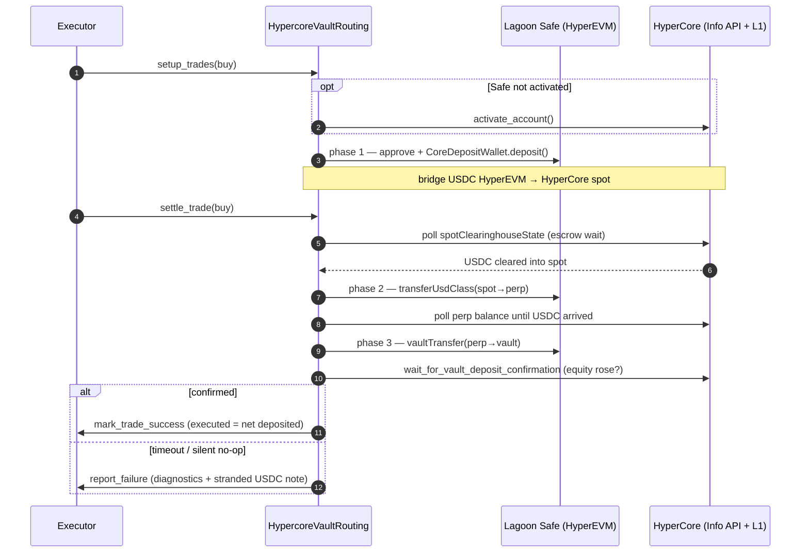
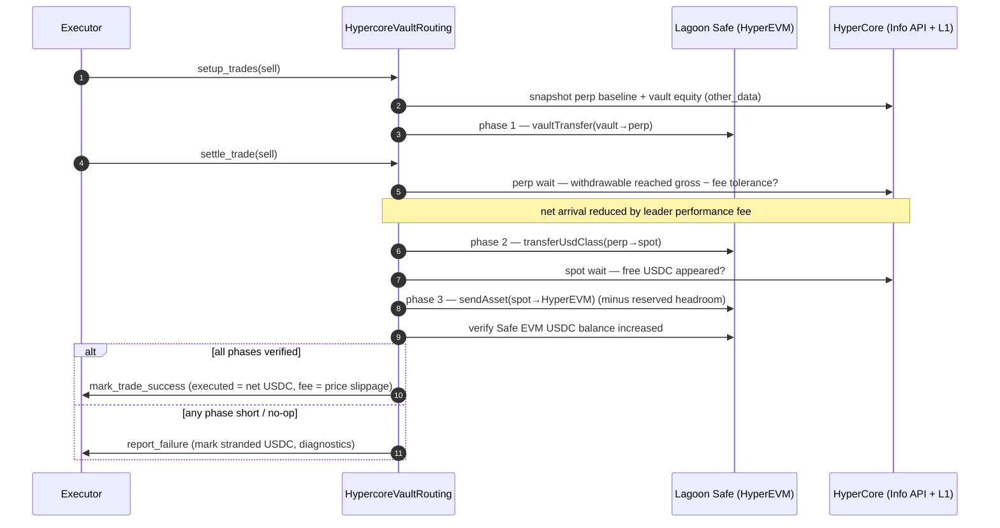
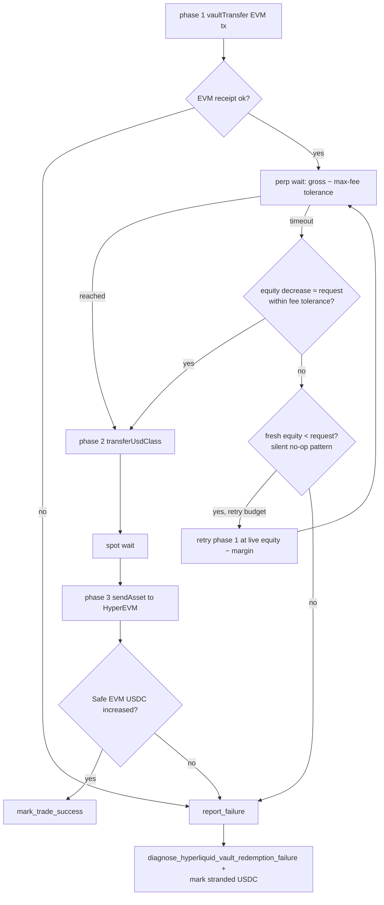

# HyperCore native vault execution

A strategy can hold a **Hyperliquid HyperCore native vault** as a trading
position — for example following a copy-trading vault like IKAGI or the
protocol HLP vault. Buying the position deposits the reserve currency (USDC)
into the vault; selling redeems it back to USDC. From the strategy's point of
view it looks like any other vault position, but the execution mechanics are
unusual: the vault does not live on an EVM chain as an ERC-4626 contract.
It lives on **HyperCore**, Hyperliquid's off-chain L1, and money has to be
walked across the HyperEVM ↔ HyperCore boundary one leg at a time.

This document explains what HyperCore vaults are, the data structures the
trade-executor uses to drive them, the multi-phase deposit and withdrawal
state machines, how we talk to HyperEVM and the HyperCore API, and where the
code lives.

> **Scope note.** This is about the strategy *depositing into an external
> HyperCore vault*. It is a different code path from the ERC-7540 / Lagoon /
> Ostium async-vault flow described in [`vault-deposit-redeem.md`](./vault-deposit-redeem.md).
> The two share vocabulary (deposit/redeem, pending, claim) but no code.

## What a HyperCore vault is

HyperCore is Hyperliquid's high-performance L1 that runs the perp and spot
order books. A **native vault** is a HyperCore primitive (not an ERC-4626
contract): depositors send USDC into the vault, the vault leader trades it,
and depositors share the PnL pro-rata. HyperEVM is the EVM-compatible chain
attached to the same validator set; USDC can be bridged between HyperEVM and
HyperCore through system contracts.

Key properties that shape our execution:

- **Off-chain accounting.** Vault equity, perp balances and spot balances live
  on HyperCore and are read over the Hyperliquid **Info HTTP API**, not via
  EVM `eth_call`. Only the bridge legs are EVM transactions.
- **Multi-account model.** A user has three relevant balances on HyperCore:
  the **vault equity**, the **perp (clearinghouse) account**, and the **spot
  account**. Moving value between them requires explicit actions
  (`vaultTransfer`, `transferUsdClass`) that settle asynchronously.
- **Leader performance fee (per vault).** User-created leader vaults charge a
  ~10% performance fee on depositor profit, deducted on or before withdrawal;
  protocol vaults (HLP and its sub-vaults) charge nothing. The net USDC a
  redemption returns can therefore be materially smaller than the gross amount
  requested. The rate is carried per vault on the trading pair
  (`other_data["vault_performance_fee"]`), not assumed as a constant.
- **Lock-ups and deposit minimums (per vault).** Deposits lock for a period
  that also differs per vault — 1 day for leader vaults, 4 days for
  protocol/HLP vaults. The client-side `MINIMUM_VAULT_DEPOSIT` check applies
  only to the deposit encoder; the withdrawal encoder has no equivalent check.
  `vaultTransfer` has no "withdraw all" mode and silently no-ops if a
  redemption asks for more than current equity.
- **Silent failures.** Bridge and transfer actions can have a successful EVM
  receipt while HyperCore moves nothing. Every phase must therefore be
  *verified* against HyperCore state, not trusted on receipt status.

For the upstream protocol and guard-side background, cross-link to eth_defi:

- `eth_defi.hyperliquid.core_writer` — CoreWriter action encoding (deposit,
  `vaultTransfer`, `transferUsdClass`, `sendAsset`).
- `eth_defi.hyperliquid.evm_escrow` — HyperEVM→HyperCore bridge escrow lifecycle.
- `eth_defi.hyperliquid.vault` — `HyperliquidVault`, `VaultInfo`,
  `estimate_max_withdrawal_commission`.
- `eth_defi.hyperliquid.api` — Info API readers (clearinghouse / vault equity).
- eth_defi docs: `docs/README-Hypercore-guard.md`,
  `docs/README-hyperliquid-vault-limitations.md`, and the
  `docs/source/tutorials/lagoon-hyperliquid.rst` tutorial.

## Data structures in trade-executor

The driver lives in `tradeexecutor/ethereum/vault/hypercore_routing.py`.

| Type | Role |
|---|---|
| `HypercoreVaultRouting(RoutingModel)` | Builds, signs, broadcasts and verifies all phases. Holds the HyperEVM `web3`, the `LagoonVault` (whose Safe is the on-chain account), the deployer `HotWallet`, and the reserve token address. |
| `HypercoreVaultRoutingState(RoutingState)` | Per-cycle routing state. |
| `HypercoreWithdrawalVerificationError` | A phase did not reach the expected HyperCore balance within the timeout. |
| `HypercoreWithdrawalPreflightError` | Live preconditions (lock-up, positive amount, equity or liquidity) failed before broadcasting. |
| `SettlementBroadcastError` | A settlement transaction failed during pricing, signing, broadcast or confirmation; carries the partial `BlockchainTransaction`. |

From eth_defi (`eth_defi.hyperliquid`): `HyperliquidSession` (Info API client),
`HyperliquidVault` + `VaultInfo` + `VaultFollower` (vault metadata, including
`commission_rate` = leader performance fee), and `UserVaultEquity`.

### Persisted per-trade state (`trade.other_data`)

Because each phase can be interrupted by a crash or restart, the routing
persists everything needed to resume into `trade.other_data`. These keys are
the contract between `setup_trades()` and `settle_trade()`:

| Key | Written when | Purpose |
|---|---|---|
| `hypercore_phase1_spot_baseline_usdc` | setup, before deposit phase 1 | Spot balance baseline so the escrow increase can be measured. |
| `hypercore_phase1_perp_baseline_usdc` | setup, before withdrawal phase 1 | Perp withdrawable baseline; captured *before* broadcast because `vaultTransfer` can settle before receipt handling. |
| `hypercore_phase1_vault_equity_usdc` | setup / preflight | Pre-withdrawal vault equity, the "before" value for detecting whether a withdrawal already reduced equity. |
| `hypercore_activation_cost_raw` | setup, first buy | The 2 USDC activation provision deducted from the first deposit allocation. It is not the measured fee. |
| `hypercore_deposit_capital_at_risk` | during phase-1 preparation, persisted immediately before broadcast | Conservative checkpoint for USDC a node may already have accepted from the Safe. It blocks generic failed-buy refunds after a crash or indeterminate broadcast until live reconciliation. |
| `hypercore_capped_deposit_raw` | deposit preflight | Deposit capped to actual Safe EVM USDC balance. |
| `hypercore_capped_withdrawal_raw` | withdrawal preflight / retry | Withdrawal capped to live vault equity minus safety margin. |
| `hypercore_accepted_residual_writeoff_usd` / `_at` / `_reason` | verified close or local dust cleanup | Audit record for equity intentionally removed from local tracking. |
| `hypercore_close_residual_status` / `_value_usd` / `_observed_at` | verified full-close settlement | Whether the live residual was accepted or needs another close attempt. |
| `hypercore_close_residual_first_seen_at` / `_retry_count` | residual above 5 USDC | Retry diagnostics; log an escalation after three verified incomplete closes. |
| `hypercore_stranded_usdc` | on failure | Records USDC stranded mid-pipeline (perp/spot) for operator recovery and retains its reserve allocation. |
| `hypercore_failure_diagnosis` | on failure | Full diagnostic snapshot string. |

### Persisted cost measurements

Successful live settlement stores cost measurements directly on
`TradeExecution`:

| Field | Meaning |
|---|---|
| `cost_of_gas` | Confirmed HyperEVM transaction gas in HYPE. |
| `native_token_price` | Settlement-time HYPE/USD price used for gas valuation. |
| `bridge_input_amount` / `bridge_output_amount` | Principal observed on the two sides of the bridge leg. |
| `bridge_fee_amount` / `bridge_fee_asset` / `bridge_fee_usd` | Measured protocol bridge fee and its USD value. |
| `account_activation_fee_usd` | Activation provision minus the USDC observed in HyperCore spot. |
| `hypercore_close_value_loss_usd` | Signed vault-equity decrease less the USDC received and phase-3 headroom retained in spot for a full close. |
| `hypercore_close_other_loss_usd` | State-schema compatibility alias for the full-close loss used by the cost report; the bridge fee is added separately. |
| `hypercore_close_residual_value_usd` | Vault equity remaining after a full close. |
| `hypercore_cost_data_complete` | Whether all applicable measurements were captured. |

For a verified full close, `trade.other_data["hypercore_accepted_residual_writeoff_usd"]`
duplicates the accepted residual amount for the settlement audit trail.

HyperEVM-to-HyperCore deposits have no protocol bridge fee and record an
explicit zero after successful verification. Their observed spot increase is
kept as telemetry, not used as a fee: the escrow wait is tolerant and existing
vault holdings can also change NAV during settlement.

The account-activation helper does not yet return its two transaction receipts,
so activation gas cannot be attached to the first trade. Such trades remain
explicitly incomplete even when their USDC activation fee is measured.

## How execution is wired

HyperCore trades are executed sequentially, not in parallel, because the legs
mutate shared HyperCore balances and the deployer nonce:

```
LagoonExecution.execute_trades()            tradeexecutor/ethereum/lagoon/execution.py
  └─ ExecutionModel.execute_trades()        tradeexecutor/ethereum/execution.py
       └─ _execute_trades_sequentially()    (HypercoreVaultRouting.needs_sequential_trade_execution() → True)
            ├─ routing.setup_trades(...)     build + broadcast phase 1, activate if needed
            └─ routing.settle_trade(...)     finish remaining phases, verify, mark success/failed
```

`setup_trades()` activates the Safe on HyperCore if needed (buys only),
captures the baselines above, and builds **phase 1** of each trade.
`settle_trade()` dispatches by direction to `_settle_deposit()` /
`_settle_deposit_simulate()` or `_settle_withdrawal()`, which run the remaining
phases. A failure calls `report_failure()`, which surfaces as
`ExecutionHaltableIssue` and stops the sequential batch.

## Deposit (buy) flow

A deposit walks USDC from the HyperEVM Safe into the HyperCore vault:

0. **Activation** (once per Safe): `activate_account()` — only if not yet active.
1. **Phase 1**: `approve` + `CoreDepositWallet.deposit()` — bridge USDC from the
   HyperEVM Safe into HyperCore **spot** (built in `setup_trades`).
2. **Escrow wait**: poll `spotClearinghouseState` until the bridged USDC clears
   the EVM escrow into spot (`wait_for_evm_escrow_clear`).
3. **Phase 2**: `transferUsdClass(spot→perp)` then prove both the spot
   decrease and the perp increase.
4. **Phase 3**: `vaultTransfer(perp→vault)` after the perp arrival is visible;
   `wait_for_vault_deposit_confirmation` verifies vault equity rose.


```mermaid
sequenceDiagram
    autonumber
    participant EX as Executor
    participant R as HypercoreVaultRouting
    participant Safe as Lagoon Safe (HyperEVM)
    participant HC as HyperCore (Info API + L1)

    EX->>R: setup_trades(buy)
    opt Safe not activated
        R->>HC: activate_account()
    end
    R->>Safe: phase 1 — approve + CoreDepositWallet.deposit()
    Note over R,HC: bridge USDC HyperEVM → HyperCore spot
    EX->>R: settle_trade(buy)
    R->>HC: poll spotClearinghouseState (escrow wait)
    HC-->>R: USDC cleared into spot
    R->>Safe: phase 2 — transferUsdClass(spot→perp)
    R->>HC: poll perp balance until USDC arrived
    R->>Safe: phase 3 — vaultTransfer(perp→vault)
    R->>HC: wait_for_vault_deposit_confirmation (equity rose?)
    alt confirmed
        R->>EX: mark_trade_success (executed = net deposited)
    else timeout / silent no-op
        R->>EX: report_failure (diagnostics + stranded USDC note)
    end
```

### Deposit verification tolerance and NAV drift

`wait_for_vault_deposit_confirmation` confirms a deposit into an *existing*
vault position by checking that our USD equity increased by roughly the
deposited amount, accepting a shortfall of
`max(tolerance, expected_deposit * relative_tolerance)` — see
`DEFAULT_VAULT_DEPOSIT_RELATIVE_TOLERANCE` in `eth_defi.hyperliquid.api`.

The subtle part: the "increase" is measured against a **baseline equity
snapshotted minutes earlier** (before phase 1). Live perp-trading vaults (e.g.
copy-trading leader vaults) mark-to-market every block, so the vault's
*existing* holdings drift in value during the confirmation window. That drift
is subtracted from the apparent deposit, so a fully-credited deposit can look
short if the vault's own NAV ticked down in the meantime.

**Production incident (trade #1240, Loop Fund vault, 2026-07-01).** An
8.06806 USDC deposit was credited essentially to the cent — the equity jump
across two consecutive polls was 8.06608 USDC — but the ~750 USDC pre-existing
position had already marked down ~0.22 USDC (≈0.03%) versus the baseline. The
apparent increase against the stale baseline was only ~7.85 USDC, short of the
old 1% (0.08 USDC) band, so verification timed out, raised
`HypercoreDepositVerificationError`, and crashed the whole live loop even though
the funds were safely in the vault. The relative tolerance was raised to **5%**
to absorb normal perp-vault volatility over the window while still catching
genuinely rejected deposits (which show ~0% increase, not a few-percent
shortfall).

### Deposit failures, recovery and crashes

The three CoreWriter actions are not atomic at the HyperCore boundary. A
successful EVM receipt proves only EVM inclusion: HyperCore can apply the
spot→perp action while silently not applying the following perp→vault action.
The router records a conservative location and stops; it never retries a
deposit action automatically.

| Failure | Recorded location | Operator rule |
|---|---|---|
| Escrow wait times out | `hypercore_evm_escrow_or_spot` | Inspect before acting. |
| Spot→perp broadcast/poll is indeterminate | `hypercore_spot_or_perp` | Do not send a vault transfer. |
| Perp→vault broadcast/confirmation is indeterminate | `hypercore_perp_or_vault` | Recheck both perp and vault equity before repeating anything. |
| Receipt definitely reverts | Previous account (spot or perp) | The attempted action did not move funds. |

`hypercore_deposit_capital_at_risk` is written during phase-1 preparation, and
the execution model persists state after preparation and immediately before
broadcast. It remains on a trade if the process dies, a receipt is missing, or
a broadcast is ambiguous. Both automatic unconfirmed-trade repair and
state-only `repair` refuse to release that allocation: inspect the Safe, EVM
escrow, spot, perp and vault first with `check-hypercore-user.py`. A confirmed
phase-1 revert clears the marker for ordinary failed-buy accounting; a fully
confirmed vault deposit clears it as successful, non-transit capital.

For recovery, USDC in perp must move **perp → spot** before `spotSend` can
bridge it back to the HyperEVM Safe. Never run a recovery action from a timeout
message alone; a late HyperCore settlement can otherwise turn a retry into a
double deposit.

### Correct-accounts transit recovery

`correct-accounts` includes a Safe-level HyperCore transit recovery before it
performs generic reserve correction. This was added for the same failure class
as HyperAI trade #1486 and is expanded in PR #1593: a CoreWriter receipt can
be successful while USDC is actually stranded in HyperCore perp or spot.
Generic ERC-20 account correction cannot see either internal balance class.

For a Lagoon Safe with open, frozen, or closed HyperCore positions, the command snapshots live
EVM, spot and perp balances. It refuses to act when the Safe has any active
perp position; otherwise it plans `perp → spot`, waits for that exact movement,
then plans `spot → EVM` and waits for the Safe's EVM USDC balance to increase.
The normal recovery planner is enabled by default. It retains the configured
perp dust margin, but requests the entire amount just recovered from perp to
spot before separately considering pre-existing spot USDC. That distinction
returns all of the current stranded transfer when the existing spot balance
has the 0.01 USDC bridge-fee headroom; otherwise the protocol retains only that
fee margin rather than an arbitrary 0.50 USDC spot dust balance. If the amount
left after that margin is too small to balance-verify, no first leg is sent and
the tiny balance remains safely in perp for a later recovery.

Always start with:

```shell
poetry run trade-executor correct-accounts --dry-run
```

Dry-run now executes the same live snapshot and transit-action planner, and
prints each proposed recovery action, but does not require the Safe signer,
sign or broadcast a transaction, alter state, or create a state backup. It is
therefore the safe way to inspect a normal dust-preserving sweep before running
the live command.

Before either a live recovery or this dry-run planner, `correct-accounts`
checks that no open or frozen position has a planned trade or a started trade
without a transaction. This preflight is intentionally before all HyperCore
calls and mutations. It was added after the HyperAI #1486 recovery: the first
implementation returned real USDC to the Safe and only afterwards discovered an
unrelated unexecuted trade, so the command could not complete its accounting
pass. A preflight failure now proves that no Safe action was broadcast.

When the preflight names an unfinished trade, use `repair` first. Repair treats
an `expired` no-transaction trade as valid terminal history, rather than trying
to repair it: expiry happens before a transaction is created. It repairs only
planned/started no-transaction trades. If it also finds a failed HyperCore
deposit with an at-risk or stranded-USDC marker, it logs the trade and leaves
that position frozen; it does not create a counter-trade or refund an unknown
HyperCore balance. This partial repair is deliberate: it clears unrelated
coherence blockers so that the next `correct-accounts --dry-run` can inspect
the live transit balance safely. If every candidate is protected, repair makes
no state change and does not show an interactive confirmation prompt: there is
nothing safe for it to repair.

The safe operator sequence is therefore:

1. Run `repair` to clear ordinary missing-transaction trades; review any
   explicitly deferred HyperCore trade.
2. Run `correct-accounts --dry-run`; it must pass preflight and show the
   proposed `perp → spot → EVM` actions without broadcasting them.
3. Run `correct-accounts` only after reviewing that plan. It reconciles the
   recovered Safe balance through the normal accounting path.

For #1486, the default dry run above plans exactly
`perp_to_spot 48.884068` followed by `spot_to_evm 48.884068`: no incident
option is necessary. The recovery is on by default for every eligible
HyperCore vault strategy, as are the other HyperCore repair checks.

This does **not** make generic repair safe. A state file that predates a failed
deposit can still show the trade as planned and lack its at-risk marker. Do not
manually expire an ambiguous deposit merely to pass the preflight: reconcile
its live Safe, escrow, spot, perp, and vault balances first.

## Withdrawal (sell) flow

A withdrawal walks USDC back from the vault to the HyperEVM Safe through three
HyperCore legs, each verified against a balance poll:

1. **Phase 1**: `vaultTransfer(vault→perp)` — redeem to the perp account.
2. **Perp wait**: poll `clearinghouseState` until withdrawable USDC appears
   (`_wait_for_perp_withdrawable_balance`).
3. **Phase 2**: `transferUsdClass(perp→spot)`.
4. **Spot wait**: poll `spotClearinghouseState` until free USDC appears.
5. **Phase 3**: `sendAsset(spot→HyperEVM)` — bridge back; then verify the Safe's
   EVM USDC balance increased (`_wait_for_usdc_arrival`).


```mermaid
sequenceDiagram
    autonumber
    participant EX as Executor
    participant R as HypercoreVaultRouting
    participant Safe as Lagoon Safe (HyperEVM)
    participant HC as HyperCore (Info API + L1)

    EX->>R: setup_trades(sell)
    R->>HC: snapshot perp baseline + vault equity (other_data)
    R->>Safe: phase 1 — vaultTransfer(vault→perp)
    EX->>R: settle_trade(sell)
    R->>HC: perp wait — withdrawable reached gross − fee tolerance?
    Note over R,HC: net arrival reduced by leader performance fee
    R->>Safe: phase 2 — transferUsdClass(perp→spot)
    R->>HC: spot wait — free USDC appeared?
    R->>Safe: phase 3 — sendAsset(spot→HyperEVM) (minus reserved headroom)
    R->>Safe: verify Safe EVM USDC balance increased
    alt all phases verified
        R->>EX: mark_trade_success (executed = net USDC, fee = price slippage)
    else any phase short / no-op
        R->>EX: report_failure (mark stranded USDC, diagnostics)
    end
```

### Tolerances and the performance fee

The perp-wait verification is the subtle part. The gross requested redemption
can arrive short for three legitimate reasons: ordinary NAV drift, the trade's
slippage tolerance, and — dominantly — the **leader performance fee** taken
from redeemed profit. This fee is *per vault*: user-created leader vaults charge
~10%, while protocol vaults (HLP and its sub-vaults) charge 0% (and lock up for
4 days instead of 1). `_settle_withdrawal()` therefore resolves the rate per
vault with `_resolve_vault_performance_fee()` — first from the trading pair
metadata (`other_data["vault_performance_fee"]`, populated by the
trading-strategy data pipeline and by `create_hypercore_vault_pair()`), then a
live `leaderCommission` read, and only as a last resort
`HYPERCORE_DEFAULT_PERFORMANCE_FEE` (10%). It then uses the worst-case fee
(`estimate_max_withdrawal_commission(gross, rate)`) as the maximum acceptable
phase-1 shortfall. The same tolerance feeds
`_is_withdrawal_already_reflected_in_vault_equity()`, the fallback that accepts
a redemption already visible as reduced vault equity. A fee-shaped shortfall is
booked as **execution price slippage** (fewer USDC for the same quantity), not
as fewer vault units sold.

## Withdrawal settlement state machine


```mermaid
flowchart TD
    A[phase 1 vaultTransfer EVM tx] --> B{EVM receipt ok?}
    B -- no --> F[report_failure]
    B -- yes --> C[perp wait: gross − max-fee tolerance]
    C -- reached --> P2[phase 2 transferUsdClass]
    C -- timeout --> D{equity decrease ≈ request<br/>within fee tolerance?}
    D -- yes --> P2
    D -- no --> E{fresh equity < request?<br/>silent no-op pattern}
    E -- yes, retry budget --> R[retry phase 1 at live equity − margin]
    R --> C
    E -- no --> F
    P2 --> S[spot wait]
    S --> P3[phase 3 sendAsset to HyperEVM]
    P3 --> V{Safe EVM USDC increased?}
    V -- yes --> OK[mark_trade_success]
    V -- no --> F
    F --> DIAG[diagnose_hyperliquid_vault_redemption_failure +<br/>mark stranded USDC]
```

## HyperEVM interactions

Although the *vault* lives on HyperCore, every action originates as a HyperEVM
transaction signed by the deployer hot wallet and routed through the Lagoon
Safe's `TradingStrategyModuleV0`:

- **Connection.** HyperEVM `web3` is built with `create_multi_provider_web3()`
  from `JSON_RPC_HYPERLIQUID`. HyperCore *state* is read separately over the
  Info HTTP API via `HyperliquidSession` (`eth_defi.hyperliquid.session`).
- **CoreWriter system contract.** Bridge/transfer actions are encoded by
  `eth_defi.hyperliquid.core_writer` as raw action bytes and submitted to the
  CoreWriter precompile at `0x3333…3333` on HyperEVM. The `build_hypercore_*`
  helpers return `ContractFunction` objects already wrapped for the Safe, so
  the routing signs them directly with the deployer `HotWallet` rather than via
  `LagoonTransactionBuilder` (which would double-wrap them).
- **Buffered dynamic gas pricing.** HyperEVM's
  [JSON-RPC documentation](https://hyperliquid.gitbook.io/hyperliquid-docs/for-developers/hyperevm/json-rpc)
  defines `eth_gasPrice` as the next small block's base fee. The routing uses
  four times that live value as
  `maxFeePerGas`, retaining 4 gwei only as a quiet-period floor. HyperEVM
  mainnet and testnet are configured as London/EIP-1559 chains in
  `Web3Config`, preventing Web3's legacy gas-price strategy from adding a
  conflicting `gasPrice` field while building transactions. HyperEVM
  currently recommends a zero priority fee and
  [burns any priority fee paid](https://hyperliquid.gitbook.io/hyperliquid-docs/for-developers/hyperevm),
  so the routing also uses zero. Assuming the standard EIP-1559 maximum 12.5%
  per-block increase, four times the base fee covers eleven consecutive maximum
  increases, or about eleven seconds of HyperEVM small blocks; it does not
  protect a signed transaction from an indefinitely sustained fee rise.
  EIP-1559 charges the actual base fee rather than the unused fee cap, although
  the signing wallet must be able to cover the maximum gas cost. At the
  incident's 81.88 gwei base fee, a 650k-gas transaction therefore needs
  capacity for a 0.213 HYPE fee cap. An approval and deposit signed together
  need about 0.426 HYPE of available balance until the first transaction lands;
  the routing does not yet preflight this HYPE balance. Never turn the floor
  back into a ceiling:
  on 2026-08-23 HyperAI signed at 4 gwei while the observed base fee was
  81.88 gwei. The transaction could not land at that price and was no longer
  visible through any configured RPC node when confirmation timed out.
- **Big blocks guard.** `__init__` asserts the deployer is *not* in big-blocks
  mode (`fetch_using_big_blocks`), which would push txs to the ~1-minute
  mempool instead of ~1 s.
- **Multi-node broadcast.** Settlement transactions broadcast through
  `wait_and_broadcast_multiple_nodes` for reliability on HyperEVM.
- **Bridge fee.** Core→HyperEVM `sendAsset` is not fee-free. Settlement measures
  a protocol-sized HYPE spot debit, or the USDC debit beyond principal when no
  HYPE debit is observed. The USDC plausibility ceiling is the HYPE-denominated
  0.05 HYPE ceiling converted at the settlement-time HYPE/USD price. If price
  telemetry is unavailable, attribution falls back conservatively to the 0.01
  USDC operational headroom. This headroom is reserved spot capital intended
  to cover the fee, but it is not itself recorded as the fee and an unusually
  high base fee can consume or exceed it. Larger, ambiguous balance changes
  remain unknown. Protocol fee mechanics and source links are documented in
  `eth_defi.hyperliquid.constants.HYPERCORE_BRIDGE_FEE_MARGIN`.
- **Cost report.** `show-hypercore-rebalance-costs` groups normal successful
  trades by decision-cycle timestamp. Repaired, repair, test, unsuccessful and
  transactionless trades are excluded. Historic receipt gas is shown as a
  lower bound; missing bridge and close measurements remain `N/A`.

## Top-level modules and functions

**trade-executor**

- `tradeexecutor/ethereum/vault/hypercore_routing.py` — `HypercoreVaultRouting`
  with the public surface `setup_trades()`, `settle_trade()`,
  `needs_sequential_trade_execution()`, `create_routing_state()`,
  `perform_preflight_checks_and_logging()`, and the
  `diagnose_hyperliquid_vault_redemption_failure()` diagnostics. Internal phase
  helpers: `_create_deposit_or_withdraw_txs()`, `_settle_deposit()`,
  `_settle_withdrawal()`, the `_broadcast_*` phase senders, the `_wait_for_*`
  verifiers, `_resolve_vault_performance_fee()`, and `_mark_stranded_usdc()`.
- `tradeexecutor/ethereum/lagoon/execution.py` — integrates HyperCore routing
  into the Lagoon execution model (sequential execution).

**eth_defi (`deps/web3-ethereum-defi`)**

- `eth_defi.hyperliquid.core_writer` — `build_hypercore_approve_deposit_wallet_call`,
  `build_hypercore_deposit_to_spot_call`, `build_hypercore_deposit_phase2`,
  `build_hypercore_withdraw_from_vault_call`,
  `build_hypercore_transfer_usd_class_call`,
  `build_hypercore_send_asset_to_evm_call`, `compute_spot_to_evm_withdrawal_amount`,
  `MINIMUM_VAULT_DEPOSIT`.
- `eth_defi.hyperliquid.evm_escrow` — `activate_account`, `is_account_activated`,
  `wait_for_evm_escrow_clear`, `DEFAULT_ACTIVATION_AMOUNT`.
- `eth_defi.hyperliquid.api` — `fetch_perp_clearinghouse_state`,
  `fetch_spot_clearinghouse_state`, `fetch_user_vault_equity`,
  `fetch_user_abstraction_mode`, `wait_for_vault_deposit_confirmation`,
  `HypercoreDepositVerificationError`.
- `eth_defi.hyperliquid.vault` — `HyperliquidVault`, `VaultInfo`,
  `estimate_max_withdrawal_commission`.
- `eth_defi.hyperliquid.session` — `create_hyperliquid_session`,
  `HyperliquidSession`.
- `eth_defi.hyperliquid.block` — `fetch_using_big_blocks`.

## Known issues and incident history

Several production incidents have shaped the settlement logic — phantom
positions, unverified withdrawals, stranded USDC, dual-chain confirmation,
nonce sync, activation cost, bridge-dry, satellite gas, API-down crashes,
precompile stale reads, minimum deposit, big blocks, robust escrow wait, and
the phase-1 performance-fee shortfall. The constants and inline comments in
`hypercore_routing.py` carry the per-incident rationale (dated incident
references); the `CHANGELOG.md` and git history record each fix. Read those
comments before changing settlement logic.

## Profit accounting

HyperCore vault positions report profit from their **cash flows** — sell proceeds, plus the value
still held, minus what was paid — via `TradingPosition.get_cash_flow_profit_usd()`. Every dollar in
such a position enters and leaves through a trade, so this is exact and model-independent.

This matters because `is_using_internal_share_price_profit()` is also true for **exchange account**
positions, which share the same code path but must *not* use cash flows: they establish their
capital through a valuation sync rather than a trade — their opening trade is a near-zero
placeholder — and profit arrives as balance updates at a fixed price of 1.0. The branch keys on
`pair.is_hyperliquid_vault()` for exactly this reason, and `tests/exchange_account/` fails if the
distinction is dropped.

The invariant callers rely on:

```
get_realised_profit_usd() + get_unrealised_profit_usd() == get_total_profit_usd()
                                                        == cash-flow profit
```

A closed position reports **zero** unrealised profit, because it holds nothing.

The identity is exact for vault positions, which carry no interest, and holds for open, partially
sold, rebought and cleanly closed positions alike. It does *not* hold for a position closed by
`mark_down()` with residual quantity left behind, where realised profit covers only the quantity
actually sold — a pre-existing write-off path rather than something this accounting introduced.

Both halves were previously wrong (fixed 2026-08-10). `get_unrealised_profit_usd()` returned the
share-price model's whole-position profit even for closed positions, so summing realised +
unrealised double-counted them. For open positions realised came from lifetime average cost while
unrealised came from the share-price model, which measures profit on the *currently outstanding
internal supply* — the two bases stop complementing each other as soon as a position is partially
sold and rebought at another price, and the error grows with every trade. A position traded 59
times reported 13,028 USD against 6,185 USD of actual cash-flow profit.

Note that equity was never affected: `get_total_equity()` is computed from position values, not
from these accessors, which is why the defect showed up as an attribution error while equity still
reconciled exactly against cash plus holdings. Any audit comparing equity against reconstructed
P&L should also **not** subtract a redemption-fee estimate — proceeds are already booked net of
fee, so cash-flow profit carries it and subtracting again double-counts.

## Small-position cleanup

`correct-accounts` cleans tracked **HyperCore-native** vault positions below
the strategy's minimum allocation by default, plus positions already marked as
awaiting a previous cleanup redemption.  This is implemented in
`tradeexecutor/ethereum/vault/hypercore_small_position_cleanup.py`; it does
not apply to ERC-4626, ERC-7540, or Ostium vault positions.  It currently runs
through a Lagoon strategy vault's HyperCore execution route, but it cleans
HyperCore positions, not Lagoon vault shares.  Use
`--no-cleanup-hypercore-small-positions` to opt out for one run.

The cleaner uses `individual_rebalance_min_threshold_usd` (or the legacy
`minimum_rebalance_trade_threshold`) as the strategy allocation floor.  It
revalues the existing HyperCore position first, then plans a full-close trade
through the normal HyperCore router so the verified vault → perp → spot → EVM
withdrawal sequence credits actual USDC to the strategy reserve.

Full withdrawals that are marginally above live equity silently no-op. Before
each pass the cleaner refreshes live equity and checks the existing lock-up.
Once unlocked, it directly attempts a full-close redemption at any amount
that is large enough to verify every withdrawal phase after the
live-equity safety margin. It never tops up a position: the client-side 5 USDC
check belongs to the **deposit encoder**, not the withdrawal encoder, and
depositing would unnecessarily create a new lock-up. No backend redemption
minimum has been confirmed; every attempted redemption is verified for actual
balance movement.

Normal strategy withdrawals reserve `max(0.5% of the available amount, 1.50
USDC)` for NAV drift between the live read and HyperCore processing. The same
relative/floor equation is used when a partial reduction is genuinely limited
by `max_withdrawable`, when constructing a full close from fresh live equity,
and in normal phase-1 no-op retries. Planning first compares the requested
amount with the raw live cap; it does not let the safety reserve turn an
otherwise unconstrained full close into a partial close.

Planning-to-preflight cap drift is a separate decision from the amount left
below the fresh cap. A normal withdrawal accepts drift up to the same
relative/floor equation evaluated against the requested amount; larger changes
still fail rather than silently invalidating same-cycle cash planning. Once
accepted, execution independently leaves the relative/floor margin below the
fresh cap. Specialised 3–5 USDC cleanup retains the fixed 1.50 USDC cap-drift
tolerance while using only 0.10 USDC initial execution headroom, so its small
headroom cannot accidentally narrow preflight acceptance.

**Production incident (trades #1599–#1605, pmalt and Octavious Maximus,
2026-08-22/23).** Hyper AI planned pmalt sell #1605 for 6,389.537474 USDC.
Roughly 15 seconds later, immediately before transaction construction, the
fresh HyperCore `max_withdrawable` was 6,387.042495 USDC, a 2.494979 USDC
decrease. The old 1.50 USDC fixed cap-drift tolerance rejected the withdrawal
before broadcast. The whole batch stopped at its first sequential trade,
leaving #1605 started without a transaction and the six following trades
planned.

On restart, new Octavious position #510 still contained planned opening trade
#1602 but had zero executed quantity. Generic HyperCore dust cleanup used that
zero as evidence of a completed redemption, then asserted that the opening
trade was successful while constructing its local repair close. This caused a
second scheduler crash. There were therefore two independent defects: the
fixed withdrawal margin did not scale with the amount, and dust cleanup did
not distinguish an unfinished position from genuine post-redemption dust.

The withdrawal equation now selects the greater of 0.5% of the amount and the
existing 1.50 USDC floor, then rounds upwards to six-decimal USDC precision.
For the fresh pmalt cap this yields 31.935213 USDC headroom and a
6,355.107282 USDC safe request. The accepted cap drift and the headroom below
the fresh cap are additive: in the percentage regime, realised sell proceeds
can therefore be roughly 1% below the planned request in the worst case (or up
to 3.00 USDC below it while both fixed floors apply). That bounded shortfall is
preferable to aborting the complete sequential batch, while cap drift above its
configured 0.5%/1.50 USDC tolerance still fails loudly.

Separately, automatic dust cleanup first identifies a dust-sized position and
then skips it if it has no successful trade or has a planned, started, or
broadcast trade. Verified settlement may accept a residual of up to 5 USDC
after a full close; this is distinct from the 2 USDC transaction-dust rule and
never widens the close threshold for a fresh position. `correct-accounts`
ignores untracked HyperCore equity at or below 5 USDC, since it cannot safely
distinguish a retained account-scoped residual from an external micro-deposit.
Larger residuals remain tracked for another normal close attempt. These guards
are intentionally independent: changing the margin cannot make incomplete
trade state safe to repair, and the state guard cannot prevent stale live
withdrawal caps.

Cleanup uses an adaptive initial margin of at most 0.10 USDC instead of the
normal relative/floor full-close margin, because withholding 1.50 USDC would
strand a material share of a 3–5 USDC position. The redeem path retries a phase-1
silent no-op with progressively larger 0.25, 0.50, and 1.00 USDC safety
margins, but only while the resulting redemption remains above the 0.20 USDC
follow-up phase verification tolerance. The deposit constant is deliberately
not reused in the withdrawal path; normal settlement verification detects a
backend no-op. A position with
0.30 USDC or less cannot produce enough balance movement to verify every
follow-up phase after the initial margin, so it is locally closed as protocol
dust without broadcasting. A still-open residual above 0.30 USDC remains
tracked for another direct redemption pass; a residual at or below 0.30 USDC
is locally closed with a zero-quantity repair. If a routed cleanup trade
fails, its state is saved and it is left for the normal failed-trade repair
flow rather than being silently written off.

A planned trade has not entered execution and cannot execute by itself, but it
still changes the position's planned quantity. Cleanup expires such trades
after it refreshes live equity but before it decides how to handle the
position, including a lock-up deferral or local dust closure. It creates a
replacement full close only when the refreshed position is eligible. Started
or broadcast trades are never superseded and keep the position ineligible for
cleanup.

Use `correct-accounts --dry-run` to refresh live balances and rehearse every
pre-broadcast cleanup step: stale-plan reconciliation, close-trade planning,
live lock-up and withdrawal preflight, routing, transaction construction, and
signing. The rehearsal uses isolated state copies and stops before broadcast
or settlement. After a successful rehearsal, it reports accounting corrections
without persisting trades, backing up, or saving state. `--skip-save` is not a
dry-run flag: it can still broadcast transactions before skipping the final
state write.

## Testing

HyperCore execution cannot be exercised against a normal EVM testnet — the
vault lives on HyperCore and the bridge legs need the real Info API and
CoreWriter. The test suite therefore layers several patterns, from fully
mocked unit tests up to manual mainnet trials.

### Testing patterns

**1. Phase-level unit tests (no chain, no network).** The most common and
fastest pattern. Construct a routing object with
`object.__new__(HypercoreVaultRouting)` and attach `MagicMock`s for `web3`,
`lagoon_vault`, `deployer` and `_session` (see `_make_routing()` in
`tests/hyperliquid/test_hypercore_dual_chain.py`). Patch the `_fetch_safe_*`
balance readers and `time.time` / `time.sleep`, then call a single verifier
(`_wait_for_perp_withdrawable_balance`, `_is_withdrawal_already_reflected_in_vault_equity`,
`_settle_withdrawal`) and assert on tolerances, fee handling, retries and
failure branches. Files: `test_hypercore_dual_chain.py`,
`test_hypercore_routing.py`, `test_hypercore_deposit_verification.py`,
`test_hypercore_deposit_settlement.py`, `test_hypercore_stranded_usdc.py`,
`test_hypercore_escrow_robust.py`.

When mocking, patch in the module namespace
(`tradeexecutor.ethereum.vault.hypercore_routing.<name>`), and remember that
patching `time.time` with a fixed list is fragile because Python's logging
also calls it — use a monotonic counter (`_monotonic_time()`), not a finite
`side_effect` list.

**2. Live-loop settlement tests.** Drive the whole execution model
(`setup_trades` → `settle_trade`) for a deposit/withdrawal cycle with the
balance fetchers and `_wait_for_*` helpers monkeypatched to simulate HyperCore
arrivals (including fee-shaped shortfalls). See
`tests/hypercore_writer/test_hyper_ai_live_loop.py` and its `conftest.py`.
These catch wiring bugs the phase-level tests miss — e.g. a helper signature
change must be reflected in the monkeypatch lambda.

**3. Sample-state regression tests (reproduce production incidents).** Many
HyperCore bugs only appear with a real, messy state file. The `*_sample_state.py`
tests load a production state snapshot (e.g. `~/hyper-ai-5.json`) and run a CLI
command (`correct-accounts`, `repair-hypercore-dust`) against it to prove the
incident is handled. These are typically scaffolded with the
**`create-test-from-prod`** skill (`.claude/skills/create-test-from-prod/`),
which downloads live state and builds the test. They require env vars
(`TRADING_STRATEGY_API_KEY`, `JSON_RPC_HYPERLIQUID`) and are skipped when the
state file or keys are absent. Files: `test_hypercore_phantom_position_sample_state.py`,
`test_hypercore_account_checks_sample_state.py`,
`test_cli_repair_hypercore_dust_sample_state.py`,
`test_correct_accounts_hypercore.py`, `test_hypercore_snapshot_failure.py`.

**4. Simulate mode and Anvil fork.** With `simulate=True` the routing uses a
batched multicall against a **mock CoreWriter** contract and skips the HyperCore
balance verification (the mock does not bridge). This is how the crosschain
deposit/withdrawal path is exercised on an Anvil HyperEVM fork — see
`tests/ethereum/test_lagoon_crosschain_hypercore_simulated.py` and
`tests/test_generic_router_hypercore_satellite.py`.

**5. Backtest / valuation replay.** `tradeexecutor.testing.hypercore_replay`
(`HypercoreDailyMetricsReplay`) replays recorded vault metrics so valuation and
backtests are deterministic — see `tests/hypercore_writer/test_hypercore_replay.py`
and `tests/hyperliquid/test_hypercore_valuation.py`.

Run a single test with the env sourced (HyperCore tests need API keys and the
HyperEVM RPC):

```shell
source .local-test.env && poetry run pytest tests/hyperliquid/test_hypercore_dual_chain.py -k performance_fee
```

### Manual testing

For changes that touch real bridge behaviour, verify against mainnet with the
operator scripts and CLI commands (all read connection/keys from the
environment, never hardcoded):

- `scripts/hyperliquid/test-hypercore-escrow.py` — drive a real HyperEVM→HyperCore
  deposit and watch the EVM escrow clear into spot.
- `scripts/lagoon/manual-trade-executor-crosschain-hypercore.py` — run a full
  crosschain HyperCore deposit/withdrawal end-to-end through the Lagoon Safe.
- `scripts/audit-hypercore-redemption-state.py` (→ `audit-redemption-state.py`) —
  audit a state file for stranded USDC / unfinished redemptions.
- `trade-executor repair-hypercore-dust` (`tradeexecutor/cli/commands/repair_hypercore_dust.py`) —
  clean up untracked vault dust left after capped withdrawals. Its withdrawal
  path does not reuse the deposit encoder's 5 USDC check.
- `check-hypercore-user.py` — referenced by the failure diagnostics
  (`hypercore_stranded_usdc` recovery note) to inspect a Safe's live HyperCore
  perp/spot/vault balances before manually completing a `spotSend` or deposit.
- CLI: `check-wallet`, `check-accounts`, `correct-accounts`, `lagoon-redeem`
  for live reconciliation and manual redemption.
- `scripts/hyperliquid/Safe-Hypercore-Writer-trials.md` — the recorded log of
  manual mainnet trials (addresses, nonces, tx hashes, timeline, observed
  bridge amounts/fees); append to it when running new manual trials.

When a manual trial uncovers a bug, capture the production state and turn it
into a sample-state regression test (pattern 3) so the fix stays covered.
