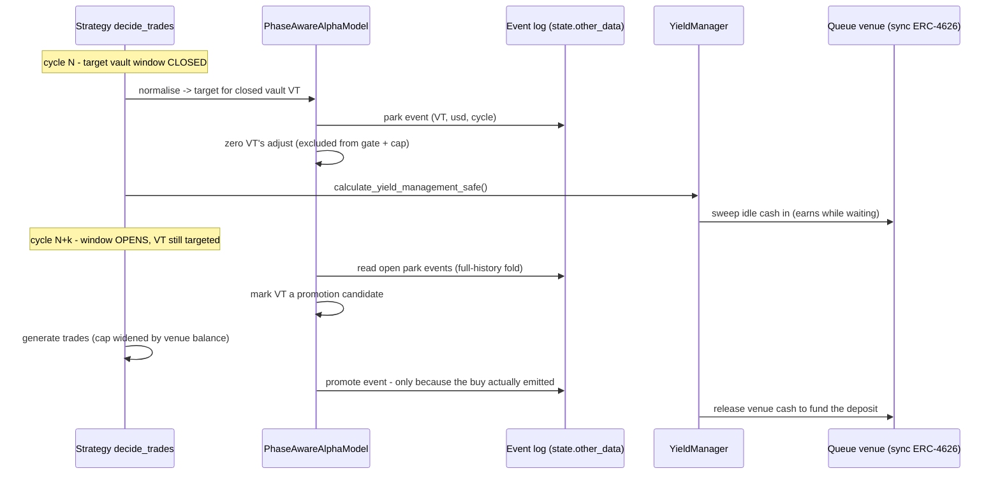

# Phase-aware alpha model

`PhaseAwareAlphaModel` decouples *deciding* a vault allocation from *executing*
the deposit. Allocation intent is recomputed every strategy cycle (on trailing
returns, as usual), but execution is often gated — a deposit window is closed,
an async redemption is settling, a size cap binds — and the capital caught in
between used to sit as 0%-yield USDC. The phase-aware model defers a
closed-window deposit instead of skipping it, parks the capital in a
yield-bearing **queue vault**, and re-emits the deposit when the window opens.

This document explains why the model exists, the architecture and mechanism,
the correctness invariants an implementer must not undo, how backtest window
modelling works, and the operator diagnostics. The final section maps the code,
tests and related documents.

**Scope note.** The queue vault here is a vault the strategy *deposits into* as
a cash home (see `.claude/docs/vault-deposit-redeem.md` for depositor-side vault
flows). It is unrelated to the strategy's own treasury being a vault
(`pending_redemptions`, owner-side Lagoon queues) — the two share vocabulary but
are separate systems.

## Why it exists

Two problems with one root, observed on the capped-waterfall cross-chain vault
reference strategy (`strategies/test_only/08-backtest-capped-waterfall.ipynb`):

1. **Idle-cash leak.** Idle USDC climbed to ~24% of equity against the ~10%
   implied by `allocation_pct = 0.90`. The leak is capital *decided-for but not
   placeable this cycle*: async redemption delays pin positions, same-cycle
   financing counts only synchronous sell proceeds, size/pool caps leave
   overflow, and the structural `(1 − allocation_pct)` reserve is never
   targeted. All of it fell back to unproductive cash.
2. **Window-gated vaults.** D2 (HYPE++), Gains and Ostium open for deposits and
   redemptions only a few days per epoch, misaligned with a 1-day cycle. The
   base `AlphaModel` *skips* a closed-window deposit
   (`_on_deposit_window_closed` → `cannot_deposit` flag + `missed_deposit_usd`),
   so the intended allocation reverts to idle cash every cycle.

The shared root: allocation intent is computed every cycle, but execution is
gated, and the in-between capital earns nothing. The phase-aware model gives
that capital a productive home and lets the intent persist across windows. It
does **not** shorten any queue — a non-redeemable position is still pinned, an
async settlement still takes as long as it takes.

## Architecture — one owner per concern

The load-bearing design decision (an early draft had two components owning the
same cash):

- **`YieldManager` owns the cash home.** Every queue-venue trade — sweeping
  idle cash in, releasing cash out to fund directional buys — is generated by
  the existing `tradeexecutor/strategy/pandas_trader/yield_manager.py`, called
  after the alpha model in the same `decide_trades`. The venue set is declared
  as an ordinary `YieldRuleset`; there is no bespoke resolver.
- **`PhaseAwareAlphaModel` owns the intent.** It defers a closed-window buy,
  logs a durable park event, re-emits the buy when the window opens, and
  exposes the diagnostics. **It never emits a queue-venue trade.**

The two interact numerically in exactly one place: the same-cycle cash cap
(invariant 4 below).

The model is **allocation-method-agnostic**: the phase-aware pass runs after
whichever `normalise_weights` variant the strategy picked (simple, size-risk,
size-risk-positions, waterfall), operating on the computed `self.signals`. The
only requirement is that normalisation stays *window-agnostic* — a closed vault
keeps its target (the slot-holding invariant), so deferring its buy leaves its
target-cash unspent without reallocating it to anyone else.

### Wiring in decide_trades

```python
rules = create_yield_rules(parameters, strategy_universe)
alpha = PhaseAwareAlphaModel(
    timestamp,
    cycle=input.cycle,                          # None -> phase-aware passes inert (base skip behaviour)
    venue_pair_ids=queue_vault_pair_ids(rules),
)
# ... set_signal() for each candidate, then (order matters):
alpha.carry_forward_non_redeemable_positions(position_manager)   # MUST precede select_top_signals
alpha.select_top_signals(count=...)
alpha.assign_weights(...)
alpha.normalise_weights(...)                                     # any variant
alpha.update_old_weights(state.portfolio, ignore_credit=False)   # venue excluded (invariant 2)
alpha.calculate_target_positions(position_manager)
alpha.apply_phase_aware_intent(position_manager)                 # park closed-window deposits; mark promotes
trades = alpha.generate_rebalance_trades_and_triggers(...)       # cap counts venue cash (invariant 4)
alpha.reconcile_phase_aware_events(position_manager, trades)     # finalise promotes that actually emitted
yield_result = YieldManager(position_manager, rules=rules).calculate_yield_management_safe(yield_input)
trades += yield_result.trades                                    # sweep idle -> venue; release venue -> fund buys
```

### The three base hooks

The base `AlphaModel` was refactored (behaviour-preserving, PR-0) into small
protected hooks so the subclass overrides variation points instead of
copy-pasting large methods:

| Hook | Base behaviour | Phase-aware override |
|---|---|---|
| `_available_same_cycle_cash` | `get_current_cash()` | `+ queue_venue_redeemable()` (invariant 4) |
| `_count_position_in_old_weights` | composite predicate (CCTP bridges, credit) | additionally excludes venue pair ids (invariant 2) |
| `_on_deposit_window_closed` | skip: `cannot_deposit` + `missed_deposit_usd` | **not overridden** — parking happens in `apply_phase_aware_intent` *before* generation, so deferred buys are excluded from the min-trade gate and the cash cap; the base hook remains the degraded/skip path |

### A window cycle, end to end



## The mechanism

**Phase 1 — park (before trade generation).** For each fresh positive deposit
signal whose window is closed (`can_deposit()` false; settlement-pending pins
are left to the base model): zero the adjustment, flag
`parked_in_queue_vault`, record `parked_usd`, and log a park event. Parking
*before* generation matters twice: the whole-portfolio `min_trade_threshold`
gate no longer counts the deferred buy (a parked dominant signal cancels the
cycle cleanly; a parked non-dominant one leaves the other trades intact), and
the same-cycle cash cap never sees it. The unspent cash stays reserve and is
swept into the venue by YieldManager.

**Phase 2 — promote (after trade generation).** A vault with an open park
event whose window is open and which still earns a positive target this cycle
becomes a *promotion candidate*. The promote event is finalised in
`reconcile_phase_aware_events` **only if the deposit trade actually emitted** —
a buy suppressed by dust thresholds or a cycle cancellation keeps its park
event open to retry. A parked vault that no longer earns a target is
**stale-closed** (event closed, no buy); its cash stays in the venue and simply
re-competes. Note the finalisation is on trade *emission*, not execution
success: if the emitted deposit later fails at execution, the park is already
closed, but the still-targeted vault simply gets a normal directional buy on
the next open cycle, funded from the venue via the invariant-4 widening — the
mechanism self-heals without the event log.

**Redemption side — passive.** `apply_phase_aware_intent` adds no redemption
logic. Window-gated or async redemptions are owned by the existing settlement
pin (`carry_forward_non_redeemable_positions`); the phase-aware additions are
(a) settled proceeds get swept into the venue instead of idling and (b) the
per-cycle `missed_redemption_usd` markers are mirrored into durable
*redemption-locked* events for the charts (see Diagnostics). One deliberate
semantics decision: the carry-forward pin marks *any* held position whose
redemption window is closed — precautionary, exit wanted or not — and once
pinned the two are indistinguishable, so the diagnostics report
**redemption-locked value** (capital that could not be exited this cycle), not
"waiting redemptions".

### The durable event log

The single durable structure is an event log in `state.other_data`, keyed by
cycle, JSON-primitive by construction (`QueueVaultEvent`). There is no dollar
earmark anywhere.

| Kind | Meaning | Drives behaviour? |
|---|---|---|
| `park` | cash deferred for a closed-window vault | yes — dedup + promotion detection |
| `promote` | parked cash deposited on window open | yes — closes the park |
| `close` | park abandoned (vault no longer targeted) | yes — closes the park |
| `redeem_block` | a held position's redemption is blocked (window/lock-up) | no — diagnostics only |
| `redeem_clear` | the position became redeemable again (or is gone) | no — diagnostics only |

**Critical:** the log must be read as a **full-history fold**
(`read_open_park_events` / `read_open_redeem_block_events` /
`iter_all_events`), never `OtherData.load_latest()`. The framework writes
bookkeeping to `other_data` every cycle, so `load_latest` returns only the most
recent cycle that stored anything and silently drops every open event on a
quiet cycle — breaking dedup, promotion detection and reload at once. Events
carry an ISO timestamp so charts have a wall-clock axis (older logs without one
are skipped by the charts, not crashed on).

## Correctness invariants

Grounded in five review rounds of the design plan; each has a regression test.
Do not undo these.

| # | Invariant | Where |
|---|---|---|
| 1 | YieldManager owns all venue trades; the model never emits one | architecture; `test_inv1_model_never_trades_the_venue` |
| 2 | Venue excluded from `update_old_weights` (else it is sold to zero or asserts) | `_count_position_in_old_weights` override |
| 3 | Venue stays inside `total_equity` / deployable — do **not** subtract it (that strands the cash) | `test_inv3_venue_held_in_equity_while_closed` |
| 3b | The sweep is value-neutral; a swept venue does not inflate directional buys beyond investable equity | `test_inv3b_directional_buys_within_investable_equity` |
| 4 | The same-cycle cash cap counts venue-redeemable balance, or it scales a promotion down to raw cash | `_available_same_cycle_cash` override; `test_cap_buys_widened_by_venue_through_async_sell` (unit), `test_promote_survives_coincident_async_sell` (end-to-end) |
| 5 | `position_allocation = allocation_pct`, and zero/negative `available_for_yield` is an explicit path — a full venue release makes it exactly zero | `calculate_yield_management_safe()` |
| 6 | Backtest window override beats real `vault_state` (stale/always-open data must not mask a synthetic schedule) | `test_override_beats_vault_state_*` |
| 7 | Normalisation stays window-agnostic (closed vaults keep targets) — the slot-holding invariant | method-agnostic tests |
| 8 | Event log read as a full-history fold, never `load_latest` | `test_queue_event_log_full_history_fold` |

## YieldManager interplay

`available_for_yield = all_cash_like − trade_cash_diff − always_in_cash −
pending_redemptions`, with `always_in_cash = equity · (1 − position_allocation)`.
Steps 1–3 of that computation live in shared private helpers
(`_gather_yield_cash_like` + `_calculate_available_for_yield`) so the strict
`calculate_yield_management` and the zero-release-safe
`calculate_yield_management_safe` cannot drift.

Two phase-aware-driven behaviours to know:

- **Zero-release path.** With `position_allocation == allocation_pct`, a fully
  deployed cycle (promotions drew the whole venue) drives `available_for_yield`
  to zero — an *expected* state. The safe wrapper releases every venue position
  to zero instead of tripping the strict method's assert; the strict method and
  its assert remain intact for other callers.
- **Async sell proceeds are excluded from same-cycle cover.**
  `calculate_cash_needed_to_cover_directional_trades` must not count an async
  vault sell's `planned_reserve` as same-cycle `cash_released` — the proceeds
  settle cycles later, and counting them under-releases the venue so the
  promote buy fails `NotEnoughMoney` at execution. `_is_async_vault_sell`
  mirrors the classification in `AlphaModel._cap_buys_by_async_sell_proceeds`
  (feature flags, else the position's own settlement history — which also
  catches vaults simulated as async via a backtest delay override).

The venue itself must be **synchronous** (`is_async_vault()` false): a sync
ERC-4626 redeems same-cycle, which is what makes the promotion funding and the
invariant-4 widening sound. Avoid Lagoon/Ostium/Gains-style venues.

## Backtest window modelling

Real historical `vault_state` has open/closed truth but may mark D2/Gains
always-open and has no next-open column, so backtests can synthesise windows:

- **`VaultWindowSchedule`** (`tradeexecutor/backtest/vault_windows.py`): a
  look-ahead-free periodic schedule (cadence, open duration, anchor).
- **Precedence:** explicit `vault_window_overrides` > real `vault_state` >
  protocol-default cadence (`get_assumed_open_close_time` resolver). The
  override deliberately beats real data — a stale or always-open `vault_state`
  must not block a synthetic schedule. Note: the protocol-cadence layer
  currently has no caller.
- **Threading:** `TradingStrategyUniverse.vault_window_overrides` must reach
  *every* `BacktestPricing` construction path — the factory, the universe
  shortcut, both direct constructors in `backtest_runner.py` **and** the
  cross-chain generic router (`backtest_generic_router.py`). The cross-chain
  backtest uses `GenericPricing` with per-vault pricing models, so an override
  set only on one path is silently ignored.

The gates consulted each cycle are `BacktestPricing.can_deposit()` /
`check_redemption()` (live: `VaultPricing` / `HypercoreVaultPricing`). Live
generic ERC-4626 windowing needs protocol adapters — a follow-up; live
correctness today is backtest + Hypercore.

## Diagnostics and charts

Proving idle→productive is the point, so the undeployed slice has structure:

- **`equity_curve_by_chain`** (`chart/standard/weight.py`): queue-venue
  positions render as a distinct "Queue venue" band, split from directional
  chain bands and idle-cash reserve rows. Venue identity comes from state alone
  via `is_queue_vault_position()` — YieldManager stamps
  `trade.other_data["yield_decision"]` on every venue trade, and charts have no
  `YieldRuleset` config to consult. This classifies *any* YieldManager-managed
  vault venue, not only phase-aware ones (intended: a yield venue is
  reserve-like for every strategy).
- **`pending_trigger_queue`** (`chart/standard/vault.py`): the not-yet-in-flight
  buffers reconstructed from the event log — waiting deposits positive,
  redemption-locked value negative. The sibling of `pending_vault_settlements`,
  which shows *in-flight* async settlements; the two do not overlap.
- **`format_signals()`** (`alpha_model.py`): per-signal Parked USD / Waiting
  deposit USD / Waiting redemption USD columns from `parked_usd` /
  `missed_deposit_usd` / `missed_redemption_usd`.

## Limitations and follow-ups

- **Same-cycle venue funding assumes fully redeemable sync venues.** In live
  mode a synchronous venue can transiently report `maxRedeem` below its share
  balance under high utilisation. The invariant-4 widening currently counts the
  full venue value, so a promotion can still need more same-cycle cash than the
  venue can actually release and fail with `NotEnoughMoney`. Use deep,
  reliably redeemable hub-chain venues until a maxRedeem-aware clamp is added.
- **Chain-aware YieldManager.** The hub-chain venue precondition is documented
  but not enforced by the model: the invariant-4 widening is chain-blind. A
  satellite venue's cash may need a bridge that does not settle same-cycle, and
  a single hub venue can be swept with cash a same-cycle satellite CCTP bridge
  still needs. Backtests can mask this because simulated bridge settlement is
  synchronous. This is why the acceptance notebook runs a focused window rather
  than the full reference history. The follow-up unlocks the retired full-run
  acceptance criteria.

  *Partial mitigation (issue #1562).* Idle capital that settles on a satellite
  bridge position with no directional demand is no longer left stranded: the
  CCTP planner (`inject_cctp_bridge_trades`, `sweep_idle_bridge_capital` on by
  default) sweeps it back to the hub reserve, where the ordinary YieldManager
  sweep then parks it in the (hub) queue vault on a following cycle. The runner
  now runs the planner on quiet cycles too, so recovery does not depend on a
  later trade. This is deliberately hub-first — no satellite-side queue venue —
  so it does not need the chain-aware YieldManager; the satellite-side deposit
  (`sweep_bridge_cash_to_queue`) remains the follow-up. End-of-run
  `analyse_idle_bridge_capital` (`tradeexecutor/analysis/cctp.py`) reports any
  bridge cash left unswept and why. **Live note:** each bridge trade halts the
  execution batch when it goes `cctp_in_transit` — expiring the remaining
  planned trades in the batch, including a window-open promote deposit — and
  resolves via restart/retry, so the sweep makes that operational path routine.
  Strategies with short deposit windows should raise `bridge_sweep_min_usd`
  (default 1.0 USD) so a small sweep cannot expire a promote into a closing
  window. The startup ordering (CCTP retry before treasury sync and the
  accounting check in `cli/loop.py`) is load-bearing for correct reserve
  accounting.
- **Live ERC-4626 openness adapters** for deposit and redemption windows.
- **Protocol-default cadences** (resolver layer 3) have no caller yet.
- **Event log pruning is not implemented.** `state.other_data` is outside the
  normal state-pruning path, so park/promote/redeem events accumulate in live
  state. The full-history folds stay correct but get more expensive over time;
  a one-hour live cycle can append thousands of events per vault per year.
- **Redeem-event dedup is exact-float**, so live mark-to-market values append
  roughly one event per locked vault per cycle; the folds stay correct, log
  size grows. A tolerance-based dedup and/or bounded event compaction is a
  possible follow-up.
- **Yield on the structural reserve** needs a higher `position_allocation` with
  the zero-release handling — a tuning follow-up.
- **Stop-loss-only `BacktestPricing` construction** does not carry
  `vault_window_overrides`; that path sits outside the phase-aware rebalance
  flow (stop losses do not gate on deposit windows), but thread it too if that
  ever changes.

## Code map

| File | What |
|---|---|
| `tradeexecutor/strategy/phase_aware.py` | `PhaseAwareAlphaModel`, event log (`QueueVaultEvent`, `append_queue_event`, folds), venue identity helpers, `queue_venue_redeemable` |
| `tradeexecutor/strategy/alpha_model.py` | base `AlphaModel` with the three hooks, `_cap_buys_by_async_sell_proceeds`, `format_signals` columns |
| `tradeexecutor/strategy/pandas_trader/yield_manager.py` | sweep/release engine, `calculate_yield_management[_safe]`, shared availability helpers, `_is_async_vault_sell` |
| `tradeexecutor/backtest/vault_windows.py` | `VaultWindowSchedule`, `get_assumed_open_close_time` resolver |
| `tradeexecutor/backtest/backtest_pricing.py`, `backtest_runner.py`, `backtest_generic_router.py` | `vault_window_overrides` threading into `can_deposit` / `check_redemption` |
| `tradeexecutor/strategy/chart/standard/weight.py`, `vault.py` | queue-venue band, `pending_trigger_queue` |

Tests (all default no-network suite unless noted):

| Test | Covers |
|---|---|
| `tests/units_tests/test_phase_aware.py` | event-log fold, serialisation round-trip, hooks, flags, getters, venue identity |
| `tests/units_tests/test_phase_aware_alpha_model.py` | park/promote/stale-close/dedup/settlement-pin guards, invariant-4 cap widening, min-trade-gate bad path, redemption-lock lifecycle |
| `tests/units_tests/test_phase_aware_charts.py` | chart reconstruction from the event log, format_signals columns |
| `tests/backtest/test_vault_windows.py` | schedule, resolver, override-beats-vault_state precedence |
| `tests/backtest/test_phase_aware_backtest.py` | synthetic integration runs: window cycle, invariants 1/3/3b, gate survival, method-agnosticism, promote-coinciding-async-sell, settled-redeem sweep, redemption-lock sequence |
| `tests/units_tests/test_yield.py` | sweep arithmetic, zero-release wrapper, redemption withholding |
| `tests/test_capped_waterfall_phase_aware_notebook.py` | `slow_test_group` notebook smoke test |

Related material:

- `.claude/plans/phase-aware-alpha-model.md` — the design plan (review history,
  full invariant derivations).
- `.claude/plans/phase-aware-cleanup.md` — the plan-conformance findings
  register and the CU-0…CU-7 remediation record.
- `.claude/docs/vault-deposit-redeem.md` — depositor-side sync/async vault
  flows (settlement pins, `vault_settlement_pending`).
- `.claude/docs/hypercore-vault.md` — Hypercore-native vault execution (its
  `can_deposit` path is one of the live-correct window sources).
- `strategies/test_only/09-backtest-capped-waterfall-phase-aware.ipynb` — the
  self-verifying acceptance notebook (derived from `08-…`).
- PR: https://github.com/tradingstrategy-ai/trade-executor/pull/1550
