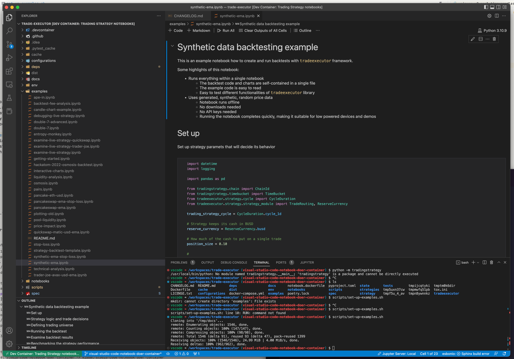
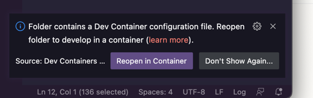
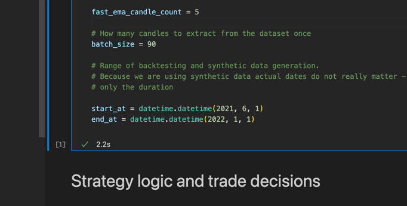
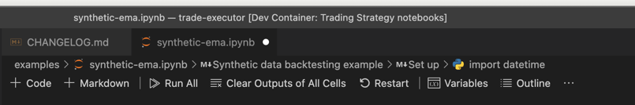
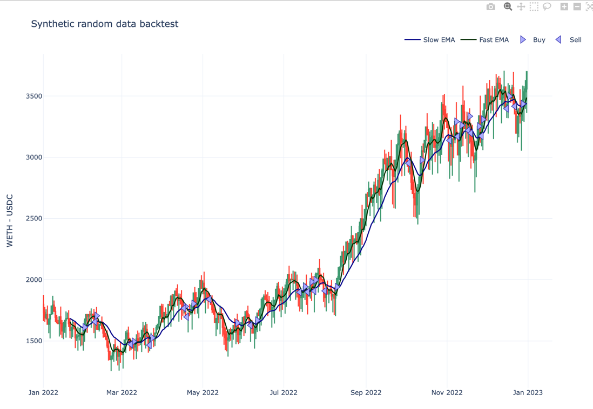
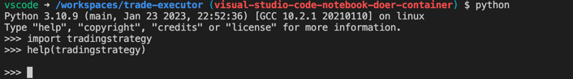

# Visual Studio Code Dev Container for Jupyter Notebooks

These instructions are for using [Trading Strategy](https://tradingstrategy.ai)
backtesting and decentralised finance research environment in [Microsoft Visual Studio Code](https://code.visualstudio.com/).



[Microsoft Visual Studio Code](https://code.visualstudio.com/), a popular editor for Jupyter notebooks.
[Dev Container](https://code.visualstudio.com/docs/devcontainers/containers) is a Visual Studio Code
feature to easily distribute ready-made development environments to users.
Dev Containers work on any operating system (Windows, macOS, Linux).
Dev Container users a special `.devcontainer` configuration format in supported Git repositories.

The Trading Strategy Dev Container is a pre-made development environment
for quant finance research in decentralised finance. 

It combines

- Trading Strategy framework and libraries
- Ready set up Python environment with correct Python interpreter
- Visual Studio Code plugins and settings needed to run and
  edit these notebooks
- Example notebooks and documentation notebooks ready in the file explorer
- The Docker image can be re-used for other Python editors and purposes;
  in this documentation we focus on Visual Studio Code as it is the easiest 
- Apple Silicon (Macbook M1) friendliness

## Prerequisites

- Existing basic knowledge of Python programming, Jupyter notebooks and data science and trading
- The set up will download 2 GB+ data, so we do not recommend to try this 
  over a mobile connection

## Setting up Visual Studio Code

- [Install Visual Studio code](https://code.visualstudio.com/)
- [Install Docker desktop](https://www.docker.com/products/docker-desktop/)
- Install the [Dev Containers extension](https://code.visualstudio.com/docs/devcontainers/containers)
  within Visual Studio Code

## Checkout the repository from Github

After you are done with the local software installation steps above,
you can check out the repository using Visual Studio Code.

Press `F1` to bring up the command palette (`fn` + `F1` on Macs)

Choose `Clone from Github`.

Paste in the repository name: ```

## Start the Dev Container

When `trade-executor` project opens you get a pop up *Reopen in container*.



Click it and Visual Studio Code will build the development environment for you.
This will take 2 - 15 minutes depening on your Internet connection speed.

You can also manually execute this action by pressing `F1` to bring up the command palette (`fn` + `F1` on Macs)
and finding *Reopen in container* action.

## Using the container

After the container is started, open Terminal in Visual Studio Code (*View > Terminal*).

Paste in the following command:

```shell
scripts/set-up-examples.sh 
```

This will create `examples` folder and copies all notebooks [from the documentation](https://tradingstrategy.ai/docs/)
there.

### Running an example

Here are short instructions how to edit and run notebooks.

Open `examples/synthetic-ema.ipynb`

Edit the backtesting period in the first code cell:




Set to 

```python
start_at = datetime.datetime(2022, 1, 1)
end_at = datetime.datetime(2023, 1, 1)
```

Then press Run all:



Now scroll to the bottom of the notebook and see you have updated results for 2022 - 2023:



### Using command line Python

If you open Visual Studio Code terminal and run `python` command
it comes with Trading Strategy packages installed.



## Troubleshooting

### No space left on device error

Make sure you clean up old Docker images, containers and volumes in your Docker for Desktop
to reclaim disk apce.

### Manual build

Building the Docker image by hand:

```shell
docker build --file .devcontainer/Dockerfile .
```


## Further reading

- https://code.visualstudio.com/docs/devcontainers/containers
- https://stackoverflow.com/questions/63998873/vscode-how-to-run-a-jupyter-notebook-in-a-docker-container-over-a-remote-serve
- https://keestalkstech.com/2022/08/jupyter-notebooks-vscode-dev-container-with-puppeteer-support/
- https://marioscalas.medium.com/using-python-and-poetry-inside-a-dev-container-33c80bc5a22c
